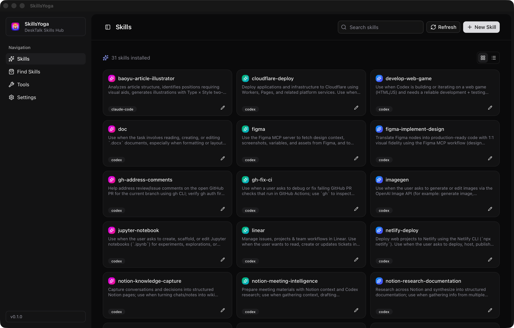
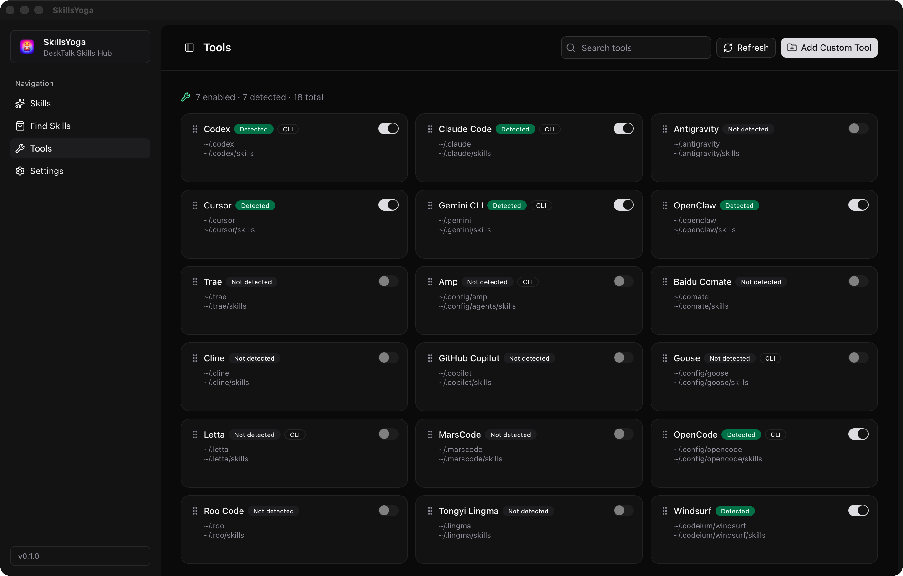
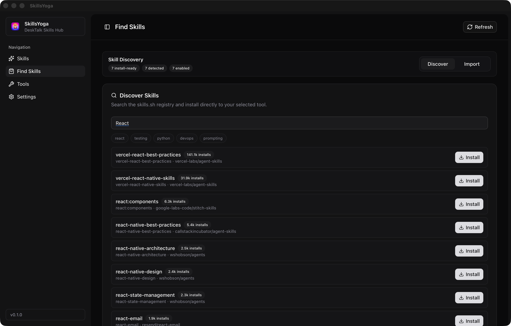
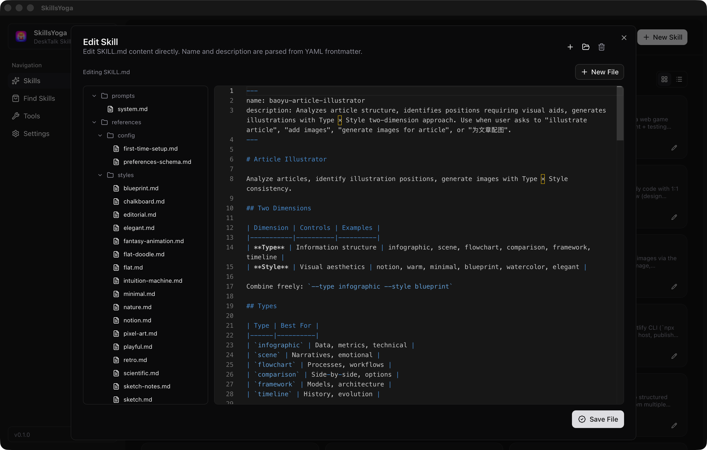

<p align="center">
  
</p>

<h1 align="center">SkillsYoga</h1>

<p align="center">A desktop skill manager for AI coding tools, built with Tauri.</p>

<p align="center">
  <a href="https://skills.yoga"></a>
  <a href="https://x.com/everettjf"></a>
  <a href="https://discord.gg/eGzEaP6TzR"></a>
  <a href="https://github.com/microclaw/skillsyoga/blob/main/LICENSE"></a>
</p>

## Overview

SkillsYoga helps you manage `SKILL.md`-based skills for different AI tools in one place.  
You can create, edit, organize, and import skills without manually switching between multiple local config folders.

## Screenshots

| Skills | Tools |
| --- | --- |
|  |  |

| Find Skills | Edit Skills |
| --- | --- |
|  |  |

## Key Features

- Unified management across multiple supported tools
- Skill file tree support (folders + multiple markdown files)
- Built-in tool detection and toggle management
- Create, edit, rename, and delete files/folders in the skill editor
- Import skills from GitHub repositories and curated sources
- Update an existing skill from GitHub directly in the editor
- Local-first storage: skills remain in each tool's own skills directory

## Supported Stack

- Tauri 2 (Rust backend)
- React 19 + TypeScript + Vite frontend
- Tailwind CSS v4 + Radix UI / shadcn-ui
- Monaco Editor for markdown editing

## Quick Start

### Install via Homebrew (macOS)

```bash
brew tap microclaw/homebrew-tap && brew install --cask skillsyoga
```

Upgrade:

```bash
brew upgrade --cask skillsyoga
```

Uninstall:

```bash
brew uninstall --cask skillsyoga
```

### Prerequisites

- Bun
- Rust toolchain
- Tauri development dependencies for your operating system

### Development

```bash
bun install
bun run tauri dev
```

### Common Commands

- `bun run dev` (frontend only)
- `bun run build` (frontend build)
- `cd src-tauri && cargo check` (Rust check)
- `bun run version:patch`
- `bun run version:minor`
- `bun run version:major`

## Usage

For a full walkthrough, see `USAGE.md`.

Basic import flow:

1. Open `Tools` and enable a target tool.
2. Open `Find Skills`.
3. Select a source or paste a GitHub repository URL.
4. Choose the target tool and install.
5. Confirm the imported skill in `Skills`.

Update flow for an existing skill:

1. Open `Skills` and edit the target skill.
2. Click `Update from GitHub` in the editor header.
3. Review the prefilled repository URL/skill path (when previously installed or updated through SkillsYoga), or enter them manually.
4. Confirm overwrite to replace the current skill files.

## Release

Version bump scripts:

- `./inc_patch_version.sh`
- `./inc_minor_version.sh`
- `./inc_major_version.sh`

Versioning rule:

- Any version containing the digit `4` is skipped automatically.
- Example: `0.1.3 -> 0.1.5`, `0.3.9 -> 0.5.0`.

Homebrew release script:

- `./scripts/release_homebrew.sh`

Optional release environment variables:

- `SIGNING_IDENTITY`
- `NOTARYTOOL_PROFILE` or (`APPLE_ID`, `APPLE_TEAM_ID`, `APPLE_APP_SPECIFIC_PASSWORD`)
- `TAP_REPO` (default: `microclaw/homebrew-tap`)
- `CASK_PATH` (default: `Casks/skillsyoga.rb`)
- `RELEASE_REPO` (default: inferred from `git remote origin`, e.g. `microclaw/skillsyoga`)
- `APP_HOMEPAGE`
- `APP_DESC`
- `SKIP_BUMP=1`
- `SKIP_NOTARIZE=1`
- `SKIP_CASK_UPDATE=1`

## Data and Privacy

- Local app state is stored in `state.json` under the app data directory.
- Skill files are stored directly in each tool's configured `skills` path.
- Uninstalling SkillsYoga does not delete skills from those tool directories.

## Contributing

Issues and pull requests are welcome.

1. Fork the repository
2. Create your feature branch
3. Commit your changes
4. Open a pull request

## License

This project is licensed under the MIT License. See `LICENSE`.

## Star History

[](https://www.star-history.com/#microclaw/skillsyoga&Date)
